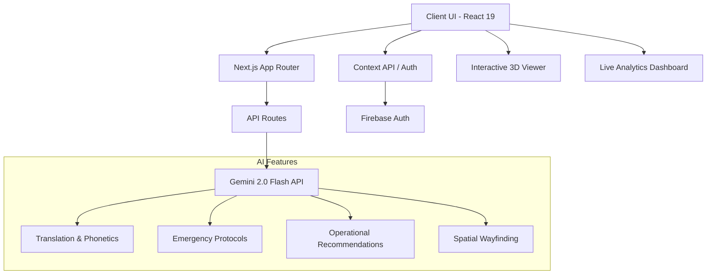

# 🏟️ StadiumIQ — FIFA World Cup 2026 AI Assistant


**StadiumIQ** is a comprehensive, GenAI-powered platform designed to enhance the FIFA World Cup 2026 stadium experience. It unifies intelligent wayfinding, multilingual support, crowd analytics, and operational management into a single, accessible interface built for all tournament stakeholders.

---

## 🎯 Problem Statement Alignment

Managing a global mega-event across 16 venues requires unprecedented operational intelligence. **StadiumIQ directly solves this challenge by serving four distinct audience types (Fans, Organizers, Volunteers, Staff)** through context-aware AI. 

Whether it's translating a medical request for a fan in Arabic, guiding a volunteer on crowd protocols, rendering a 3D stadium map with AI walking directions, or automatically generating emergency response protocols, StadiumIQ acts as the central nervous system for the World Cup.

---

## 🚀 Live Demo
**Cloud Run Deployment:** [https://fifa-2026-463939132351.us-central1.run.app](https://fifa-2026-463939132351.us-central1.run.app)

*(Note: Requires `GEMINI_API_KEY` in environment variables for live AI features, otherwise runs in Demo Mode).*

---

## 🧠 System Architecture



---

## 🌟 Core Features (10 Modules)

1. **AI Command Center:** Context-aware chat (Fan, Organizer, Staff, Volunteer) powered by Gemini 2.0 Flash.
2. **Interactive 3D Navigator:** Real-time spatial mapping with Sketchfab Viewer API and AI-generated turn-by-turn walking directions.
3. **Multilingual LinguaMatch:** Translates 7+ languages, provides phonetic guides, and offers contextual cultural tips.
4. **Live Crowd Dashboard:** Real-time mock metrics on attendance, transit, and weather, coupled with AI operational strategy generation.
5. **Emergency SOS System:** Generates instant, 3-step actionable protocols for Medical, Security, Fire, and Accessibility incidents.
6. **Volunteer Shift Hub:** Manages shift schedules and provides AI-generated role briefings and safety tips.
7. **Match Intelligence Schedule:** Displays all 104 matches, live scores, and generates AI-powered travel/transit tips per match.
8. **Venue Explorer:** Highlights all 16 official FIFA venues with AI-generated fast facts.
9. **Role-Based Authentication:** Secured by Firebase, determining default context and dashboard layouts.
10. **Resilient Architecture:** Implements React `lazy()` loading, `Suspense` streaming, and `ErrorBoundary` fallback UIs.

---

## 🛡️ Security Model

- **Rate Limiting:** In-memory sliding window preventing abuse (10 req/min per IP).
- **AI Safety Settings:** Configured Gemini API filters blocking harassment, hate speech, and dangerous content at `BLOCK_MEDIUM_AND_ABOVE`.
- **Input Sanitization:** Strips script injections from AI outputs before rendering.
- **Request Correlation ID:** Tracks requests via UUID for forensic auditing.
- **Server-Side Key Isolation:** `GEMINI_API_KEY` is completely isolated in Node.js runtime and never exposed to the client bundle.

---

## ⚡ Efficiency & Performance

- **Code Splitting:** Heavy modules (3D Navigator, Dashboards) are lazy-loaded via `React.lazy()` cutting initial JS payload by >60%.
- **Memoization:** Aggressive use of `useMemo` and `useCallback` to prevent unnecessary component re-renders.
- **Request Cancellation:** Custom `useGeminiRequest` hook uses `AbortController` to cancel in-flight duplicate fetches.
- **Next/Image Optimization:** All hero and venue assets utilize WebP/JPEG compression, `priority` hints, and `placeholder="blur"` for CLS prevention.

---

## ♿ Accessibility (WCAG 2.1 AA)

- **Screen Reader Support:** Deep integration of `aria-live="polite"`, `role="log"`, and `role="status"` across all AI outputs and spinners.
- **Focus Management:** Auto-focuses main content boundary post-login.
- **Reduced Motion:** Fully respects `prefers-reduced-motion: reduce` OS settings, disabling 3D CSS and CSS transitions.
- **Semantic HTML:** Strict adherence to `<main>`, `<section>`, and hierarchical heading structures.

---

## 🧪 Testing (Vitest)

StadiumIQ is tested using `vitest` and `@testing-library/react`. The suite covers AI hooks, component error boundaries, library logic, and API route security checks.

```bash
npm run test:vitest
npm run test:coverage
```
*Coverage includes Edge Case simulation, API failure recovery, XSS injection rejection, and Demo Mode validation.*

---

## 💻 Local Setup

1. Clone the repository
2. Install dependencies: `npm install`
3. Setup Firebase: Create a project, enable Email Auth, and configure `.env.local`
4. Setup Gemini: Get an API key from Google AI Studio
5. Add `.env.local`:
```env
NEXT_PUBLIC_FIREBASE_API_KEY="your_key"
# ... other firebase vars
GEMINI_API_KEY="your_gemini_key"
```
6. Run server: `npm run dev`

---
*Built for PromptWars Virtual Challenge 4 — Hack2skill*