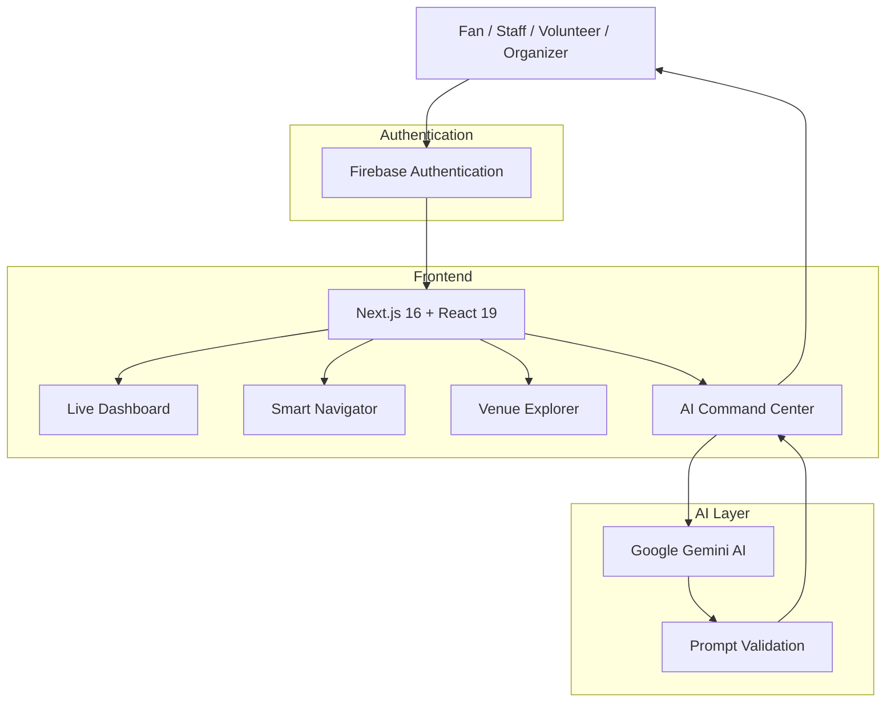
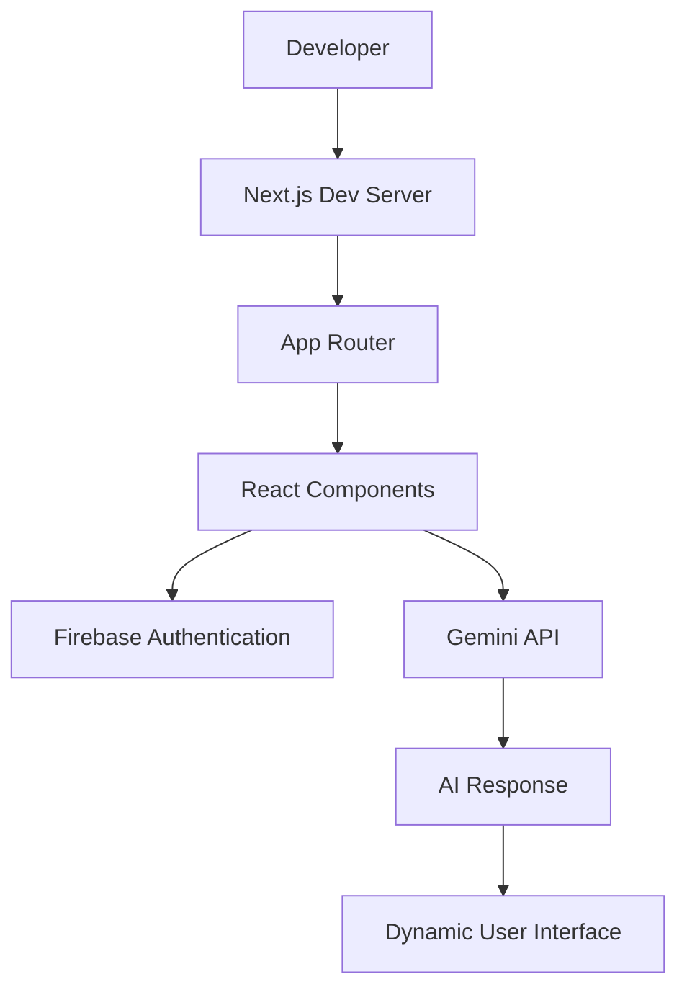

# StadiumIQ 🏟️⚽

[](https://nextjs.org/)
[](https://react.dev/)
[](https://firebase.google.com/)
[](https://ai.google.dev/)
[](https://tailwindcss.com/)
[](https://www.fifa.com/)

> **StadiumIQ** is an AI-powered stadium intelligence platform designed for the **FIFA World Cup 2026**, providing fans, volunteers, organizers, and stadium staff with multilingual assistance, smart navigation, venue insights, and real-time operational support through Google Gemini AI.

---

# 📁 Project Summary

- **Purpose:** Enhance the FIFA World Cup stadium experience using AI-powered assistance, intelligent navigation, and live venue operations.
- **Audience:** Football fans, stadium visitors, volunteers, organizers, and event staff.
- **Structure:** Next.js App Router frontend with Firebase Authentication, Gemini AI integration, and modern React architecture.

---

# 🚀 Key Features

- 🤖 AI Stadium Assistant powered by Google Gemini
- 🏟️ Interactive Stadium & Venue Explorer
- 🧭 Smart Stadium Navigator
- 🌍 Multilingual AI Support
- 📊 Live Operations Dashboard
- 🚇 Transport & Route Guidance
- 🚨 Crowd Awareness & Stadium Alerts
- 👥 Role-based Experience (Fans, Volunteers, Staff & Organizers)
- 🔐 Firebase Authentication
- 📱 Responsive Mobile-first Interface

---

# 🧭 Approach & Logic

1. Secure authentication using Firebase Authentication.
2. Personalized AI assistance based on user role.
3. Intelligent navigation across stadiums and venues.
4. Gemini generates contextual recommendations and answers.
5. Dashboard displays live operational insights for better crowd management.
6. Modern responsive UI optimized for desktop and mobile.

---

# ⚙️ How the Solution Works

1. User signs in using Firebase Authentication.
2. User selects their role (Fan, Staff, Volunteer, Organizer).
3. Next.js frontend communicates with AI services.
4. Gemini processes requests securely.
5. AI returns multilingual recommendations, navigation guidance, and venue intelligence.
6. Dashboard continuously updates operational information.

---

# 🗺️ Architecture



---

# 🧩 Code Flow



---

# 🛠️ Tech Stack

### Frontend

- Next.js 16
- React 19
- Tailwind CSS
- TypeScript

### Authentication

- Firebase Authentication

### AI

- Google Gemini API

### Development

- ESLint
- Node.js
- npm

### Deployment

- Vercel
- Firebase Hosting (Optional)

---

# 🧭 Quickstart — Local Development

### Prerequisites

- Node.js 20+
- npm

Clone the repository

```bash
git clone https://github.com/yourusername/StadiumIQ.git

cd StadiumIQ
```

Install dependencies

```bash
npm install
```

Create environment variables

```bash
cp .env.local.example .env.local
```

Add your credentials

```env
NEXT_PUBLIC_FIREBASE_API_KEY=
NEXT_PUBLIC_FIREBASE_AUTH_DOMAIN=
NEXT_PUBLIC_FIREBASE_PROJECT_ID=
NEXT_PUBLIC_FIREBASE_STORAGE_BUCKET=
NEXT_PUBLIC_FIREBASE_MESSAGING_SENDER_ID=
NEXT_PUBLIC_FIREBASE_APP_ID=

GEMINI_API_KEY=
```

Run development server

```bash
npm run dev
```

Visit

```
http://localhost:3000
```

---

# 📦 Production Build

Create production build

```bash
npm run build
```

Start production server

```bash
npm run start
```

---

# 🚀 Deploy to Vercel

```bash
npm install -g vercel

vercel
```

Or connect your GitHub repository directly with **Vercel**.

---

# ✅ Testing

Run lint

```bash
npm run lint
```

Run tests

```bash
npm test
```

Build verification

```bash
npm run build
```

---

# 🔒 Security & Best Practices

- Firebase Authentication for secure login.
- Environment variables for sensitive credentials.
- Gemini API key stored server-side.
- Prompt validation before AI execution.
- Client-side authentication state management.
- Production-ready Next.js security headers.

---

# ♿ Accessibility

- Keyboard-friendly navigation.
- Mobile responsive design.
- Semantic HTML.
- Screen reader support.
- High-contrast accessible UI.
- Multilingual AI assistance.

---

# 📁 Project Structure

```
app/
│
├── api/
├── auth/
├── dashboard/
├── navigator/
└── venues/

components/
│
├── dashboard/
├── navigation/
├── ai/
└── ui/

context/
│
└── AuthContext

lib/
│
├── firebase.ts
├── gemini.ts
└── utils.ts

public/

tests/

styles/
```

---

# 📂 Important Files

- `app/` — Next.js App Router
- `components/` — Reusable UI Components
- `context/` — Authentication Context
- `lib/firebase.ts` — Firebase Configuration
- `lib/gemini.ts` — Gemini AI Integration
- `tests/` — AI & Application Tests

---

# 🌍 Future Enhancements

- Live Match Analytics
- Indoor Stadium Maps
- Real-time Seat Navigation
- Emergency Assistance
- AI Voice Assistant
- Push Notifications
- QR Ticket Integration
- Live Crowd Density Heatmaps
- Public Transport Live Tracking
- Offline Stadium Mode

---

# ❤️ Built For

**FIFA World Cup 2026**

Empowering every fan, volunteer, organizer, and stadium staff member with AI-powered stadium intelligence.

---

## 📄 License

This project is built for educational, hackathon, and demonstration purposes.

---

<div align="center">

### ⚽ StadiumIQ

### AI-powered Stadium Intelligence for FIFA World Cup 2026

Built with ❤️ using **Next.js • React • Firebase • Google Gemini AI**

</div>